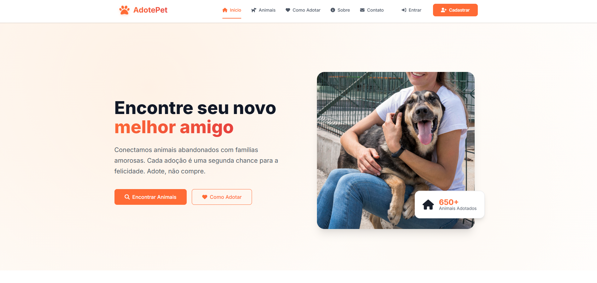
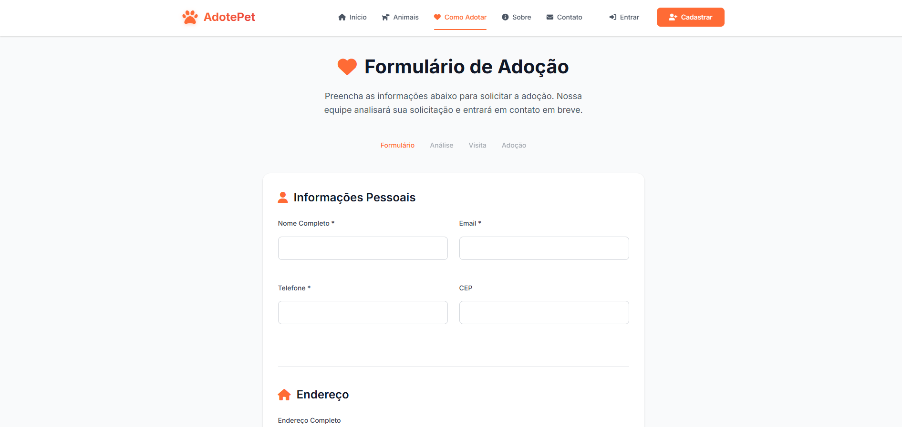
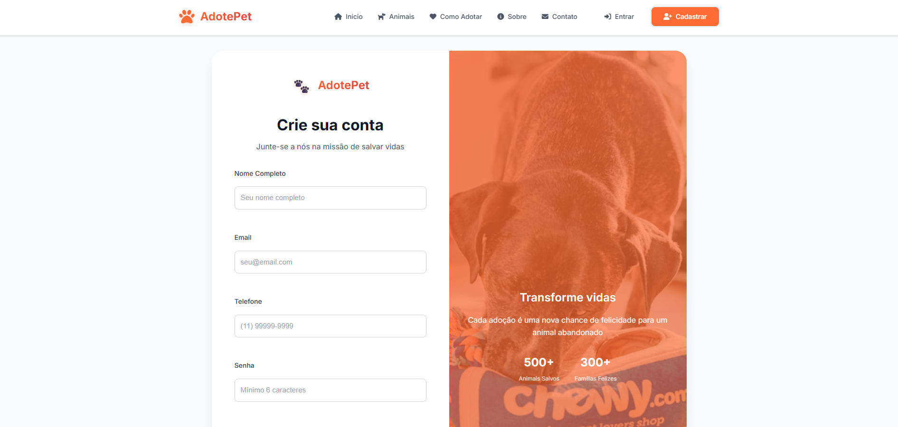

# AdotePet 

Aplicação web para adoção de animais, desenvolvida em React.

---

## 🖼️ Imagens do Projeto




## ✨ Sobre

O **AdotePet** é uma plataforma que conecta pessoas interessadas em adotar animais a ONGs e protetores. O sistema permite visualizar todos os animais disponíveis para adoção, aplicar filtros por espécie, porte e localização, acessar uma página de detalhes de cada animal (com fotos, informações de saúde e localização), e simular o processo de adoção online. Usuários podem se cadastrar, fazer login, editar seu perfil e acompanhar suas solicitações. Há também um painel administrativo (simulado) para gerenciar animais, adoções e usuários, tudo feito no frontend, sem backend ativo.

O projeto foi pensado para ser responsivo, acessível e fácil de usar em qualquer dispositivo. Todos os dados são mockados para fins de demonstração, mas a estrutura do código permite fácil integração com um backend real no futuro.

---

## 🚀 Funcionalidades

- Listagem de animais para adoção
- Filtros por espécie, porte e localização
- Página de detalhes do animal
- Processo de adoção online (simulado)
- Cadastro, login e perfil de usuário
- Painel administrativo (simulado)
- Layout responsivo

---

## 🛠️ Tecnologias

- React
- React Router
- Context API
- Font Awesome
- CSS Modules

---

## ▶️ Como rodar

1. Clone o repositório:
   ```bash
   git clone <repository-url>
   cd frontend
   ```
2. Instale as dependências:
   ```bash
   npm install
   ```
3. Inicie o projeto:
   ```bash
   npm start
   ```
4. Acesse em [http://localhost:3000](http://localhost:3000)

---

## 📁 Estrutura

```
src/
  components/    # Componentes reutilizáveis
  contexts/      # Contextos globais
  pages/         # Páginas principais
  services/      # Serviços de API (mock)
  App.js
  index.js
  index.css
```

---

## ℹ️ Observações

- Todos os dados são mockados para demonstração.
- Para integração real, basta adaptar os serviços de API para consumir um backend.

---

## 🤝 Colaboração

Contribuições são bem-vindas! Sinta-se à vontade para abrir issues ou enviar pull requests com melhorias, correções ou novas funcionalidades.

---

## 🚧 Status do Projeto

Este projeto está em andamento e pode receber atualizações

---

Feito com ❤️ para ajudar animais a encontrarem um lar!
